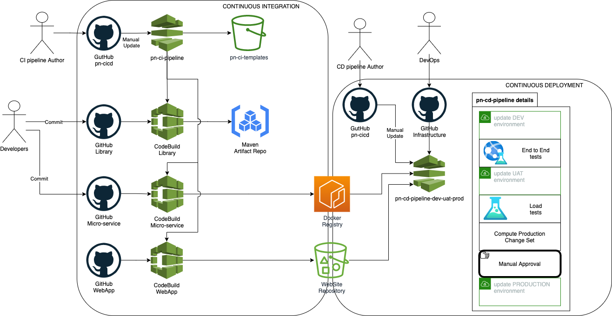

# PN CI/CD 
Continuous Integration and Continues Delivery per Piattaforma Notifiche

## Overview

## Continuous Integration
See [ci/README.md](ci/README.md)

## Continuous Delivery
See [cd/README.md](cd/README.md)

## WARNING: Hardcoded AccountId 
The list of the "AWS account id" allowed to access to Continuous Integration 
artifacts is hardcoded in the [ci/bootstrap.sh](ci/bootstrap.sh) file in the
_"Deploy CI pipeline"_ command.

