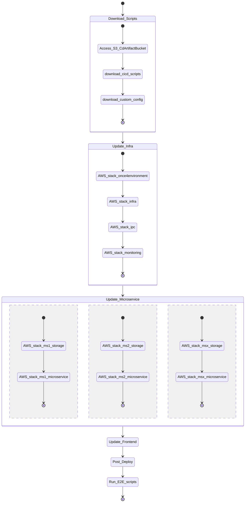

# Continuous Delivery Piattaforma Notifiche

## Context 
Piattaforma notifiche consists of several AWS accounts that group together components with specific requirements.
Each of these clusters runs specific components and defines its own stack to implement the CD processes.
At the moment the stacks are :

* CORE [cd-cli/cnf-templates/complete-pipeline.yaml](cd-cli/cnf-templates/complete-pipeline.yaml)
* DATAVAULT [cd-cli/cnf-templates/data-vault-only-pipeline](cd-cli/cnf-templates/data-vault-only-pipeline)

Each of these stacks share the same base structure and specialize only the applications.

## COMPLETE-PIPELINE

The Complete Pipeline Stack [cd-cli/cnf-templates/complete-pipeline.yaml](cd-cli/cnf-templates/complete-pipeline.yaml) aims to deploy all the CORE site of Piattaforma Notifiche. 

Basically it define a set of CodeBuild projects that take care of the relase of all the applicative components (infrastructure, microservices, web application).
It also define a specific CodeBuild project called _ChooseAndLaunchPipelineCodeBuild_ that process the event produced by the CI pipeline and schedule the deploy of the related application

The applicative CodeBuild projects can be executed by two pipeline:

* Complete Pipeline - a pipeline that handle the release of the entire site
  * It runs with a specific time schedule
  * It relase both the infrastructure and the applicative components
  * It execute the E2E testing
* Application Pipeline - a pipeline specific for any application
  * It runs when the _ChooseAndLaunchPipelineCodeBuild_ process the related event
  * It release the specific component (infrastructure or applicative )

### Complete Pipeline Overview

