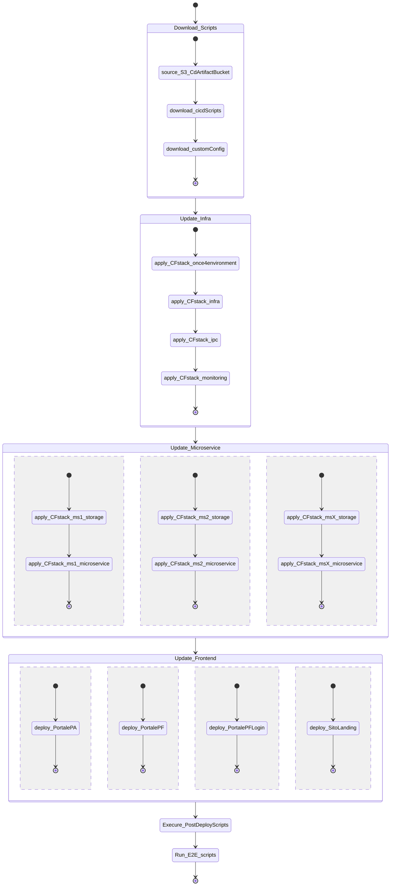
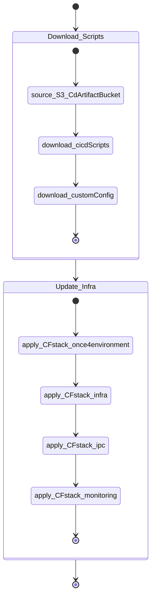
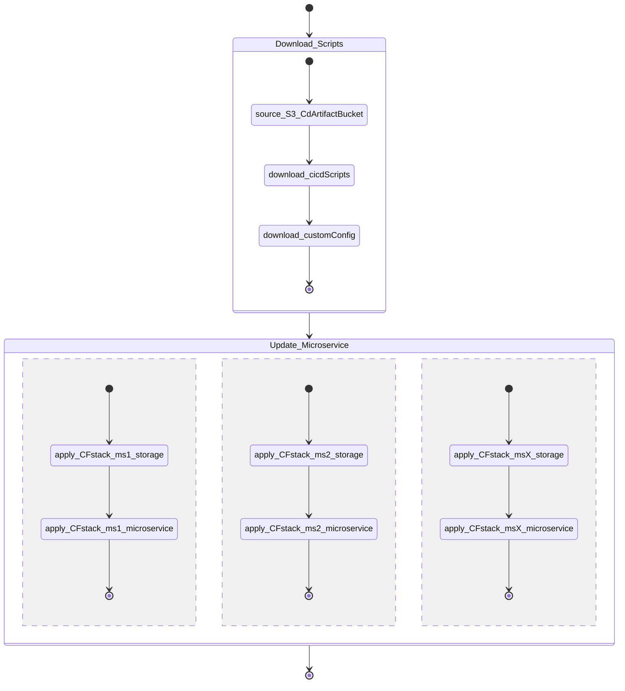
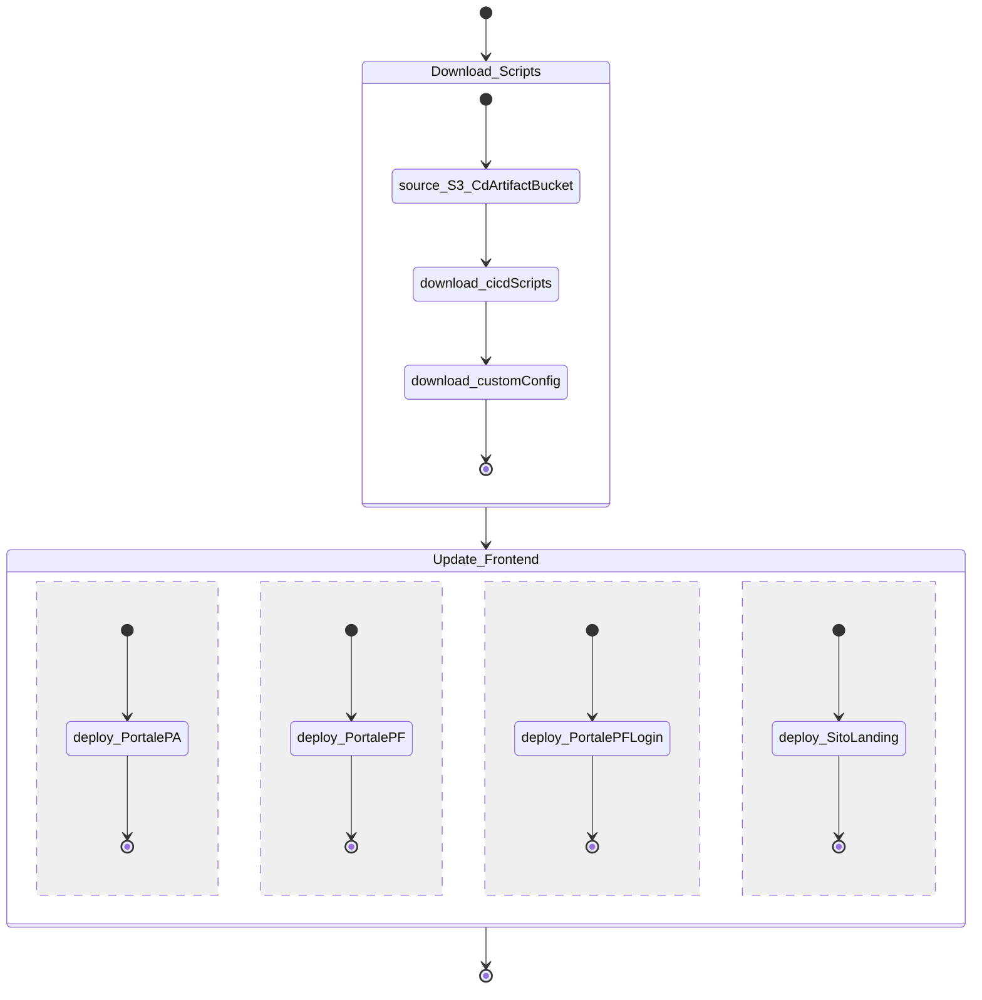

# Continuous Delivery Piattaforma Notifiche

## Context 
Piattaforma notifiche consists of several AWS accounts that group together components with specific requirements.
Each of these account runs specific components and defines its own stack to implement the CD processes.
You can find all the available stacks in the folder _cd-cli/cnf-templates_:

* CORE [cd-cli/cnf-templates/complete-pipeline.yaml](cd-cli/cnf-templates/complete-pipeline.yaml)
* DATAVAULT [cd-cli/cnf-templates/data-vault-only-pipeline](cd-cli/cnf-templates/data-vault-only-pipeline)

Every stack is replicated on all the environments (dev, svil, coll, hotfix, etc... )

Each of these stacks share the same structure, only the applications vary.

## COMPLETE-PIPELINE

The Complete Pipeline Stack [cd-cli/cnf-templates/complete-pipeline.yaml](cd-cli/cnf-templates/complete-pipeline.yaml) aims to deploy all the CORE site of Piattaforma Notifiche. 

Basically it defines a set of CodeBuild projects that deal with the release of all the application components (infrastructure, microservices, web application).

It also defines a specific CodeBuild project called _ChooseAndLaunchPipelineCodeBuild_ which processes the event produced by the CI pipeline and schedules the deployment of the related application

A single application could be deloyed by one of the following pipelines:

* Complete Pipeline - a pipeline that handle the release of the entire site
  * It runs with a specific time schedule
  * It relase both the infrastructure and the applicative components
  * It execute the E2E testing
* Application Pipeline - a pipeline specific for any of the applications
  * It runs when the _ChooseAndLaunchPipelineCodeBuild_ process the related event
  * It release the specific component (infrastructure or applicative )

### Complete Pipeline Overview

The _Complete Pipeline_ aims to deploy the entire CORE site.

The pipeline is time consuming and it is executed automatically every hour.

It is composed of two stages:

1. __Download Configurations__ :  this is the source of the pipeline. It reads the commit_id from all the involved components from an S3 bucket and then it start the deploy
2. __Deploy All__ : this is the implementation of the deploy process. Below the complete graph

### Application Specific Pipeline

Every component, both infrastructure and microservices or frontend, has its own specific deploy pipeline.

When the CI is executed (both manually or automatically) it generates a _CIEventBus_ event that is delivered to all the AWS Accounts.

Each of these AWS Account receive the event in its own EventBridge, and implements the logic to understand if that event should trigger a deploy.

When the event is related to a component that has to be deployed than the CodeBuild project _ChooseAndLaunchPipelineCodeBuild_ will be triggered.

The _ChooseAndLaunchPipelineCodeBuild_ then triggers the application specific pipeline.

Any of the application specific pipeline is composed of two stages:

1. __Download Configurations__ :  this is the source of the pipeline. It reads the commit_id from all the involved components from an S3 bucket and then it start the deploy
2. __Deploy Component__ : this is the implementation of the deploy process. Depending on the type of the component, these are the complete graphs

#### Deploy Component: Infra

#### Deploy Specific Component: Microservice

#### Deploy Component: Frontend

