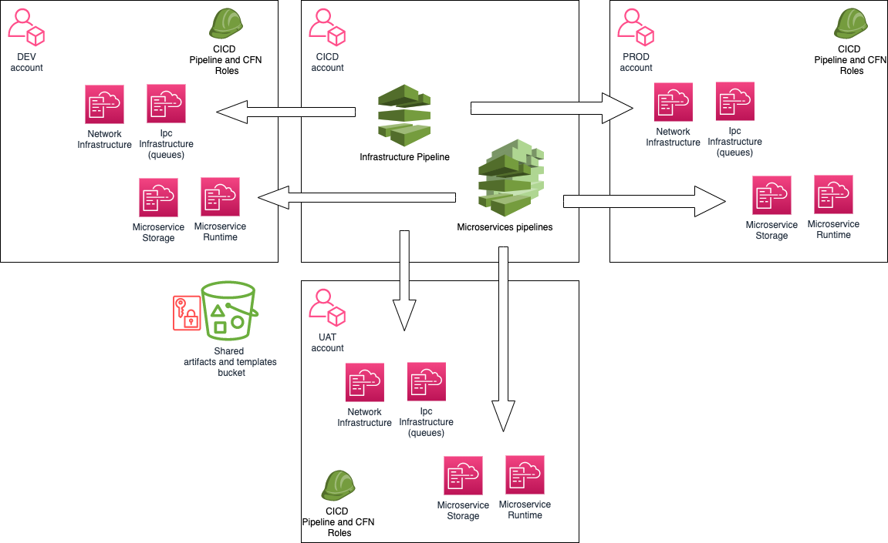

# Continuos Delivery Pipelines internals

## Big Picture


The CICD account contains pipelines that deploy CFN stacks in _dev_, _uat_ and _prod_ accounts.

### Artifact & Cloud Formation templates Buckets

To be able to deploy stacks and artifacts in the target account 2 shared bucket are used:
1. deploy artifacts 
2. CFN templates (used nested stack). 

Buckets have encryption enabled and _encryption key_ is managed by 
[cicd-pipe-00-shared_buckets_key.yaml](cfn-templates/cicd-pipe-00-shared_buckets_key.yaml)
template.

### Pipeline Roles in target account

The [target-pipe-20-cicd_roles.yaml](cfn-templates/target-pipe-20-cicd_roles.yaml) CFN templates contains the 
_role definition_ for each _dev_, _uat_ and _prod_ accounts that enable to CiCd account to deploy stacks into
target accounts.

## The infrastructure pipeline

Defined in [cicd-pipe-50-infra_pipeline.yaml](cfn-templates/cicd-pipe-50-infra_pipeline.yaml) is composed 
of the following steps
- Checkout infrastructure templates
- Copy it to an S3 bucket (useful for nested stack)
- Deploy development account
  - Deploy a "once for account" template (useful for global configuration like API-Gateway log 
    configuration and Chatbot slack subscriptions)
  - Merge CFN parameters file for next step with output from previous step
  - Deploy "network infrastructure" CFN template
  - Merge CFN parameters file for next step with output from previous step
  - Deploy "Inter Process Comunication infrastructure" CFN template (usually some queue)
- Deploy User Acceptance Test account: same step of dev account but ask manual approval and
  use different parameters file.
- (TODO) Deploy Production account

*<base>* means the *infrastructure.repo-subdir* configuration value.

#### 1. Deploy infrastructure CNF template on each _dev_, _uat_, _prod_ account.

This script is read from the infrastructure git repository 
[pagopa:pn-infra](https://github.com/pagopa/pn-infra) the file
`once4account/<env-name>.yaml` 

- __Responsability__: configure global resources.
    - API-Gateway log configuration & Role
    - Chat-bot slack subscriptions (exported in output)
    - Certificate Expiration Alarm
- __Input__: 
     - _TemplateBucketBaseUrl_: [mandatory] containing the base URL of 
      infrastructure CFN fragments.
     - _SlackInfo_: [default] Slack workspace and channel 
- __Output__: 
    - _AlarmSNSTopicArn_: SNS Topic Arn for slack Chat-bot

### 2. Networking infrastructure CNF template
This script is read from the infrastructure git repository [pagopa:pn-infra](https://github.com/pagopa/pn-infra) 
with path `<base>/pn-infra.yaml`

- __Responsability__: configure networking infrastructure
  - _VPC_ (see: fragments/vpc.yaml)
  - _VPC Endpoints_ (see: fragments/vpc-endpoints.yaml)
  - _Load Balancer_ (see: fragments/load-balancer.yaml)
  - _ECS Cluster_ (see: fragments/ecs-cluster.yaml)
- __Input__: file, previous step and some mandatory parameters
    - _ProjectName_: the _project name_ configuration value
    - _VpcNumber_: Second byte from the left for VPC CIDR
    - _TemplateBucketBaseUrl_: containing the base URL of infrastructure CFN fragments
    - _AlarmSNSTopicArn_: output from previous step.
    - File ```<base>/pn-infra-<env-name>-cfg.json``` from infrastructure repository
- __Output__: any output useful for next steps.

### Ipc infrastructure CNF template
This script is read from the infrastructure git repository [pagopa:pn-infra](https://github.com/pagopa/pn-infra)
with path `<base>/pn-ipc.yaml`

- __Responsability__: configure communication between microservices and define all CFN
  parameters that microservices can use.
- __Input__: file, previous step and some mandatory parameters
  - _ProjectName_: the _project name_ configuration value
  - TemplateBucketBaseUrl: containing the base URL of infrastructure CFN fragments
  - File ```<base>/pn-ipc-<env-name>-cfg.json``` from infrastructure repository
  - The outputs of "networking infrastructure" CFN templates
- __Output__: any output useful to the microservices.

## The microservices pipelines
Defined in [cicd-pipe-70-microsvc_pipeline.yaml](cfn-templates/cicd-pipe-70-microsvc_pipeline.yaml) has the 
following steps
- Checkout microservice container image, microservice CFN templates and infrastructure CFN templates
- Copy infrastructure CFN templates to an S3 bucket (useful for nested stack)
- Deploy development account
  - Deploy a "microservice storage" CFN template
  - Merge CFN parameters file for next step with output from previous step
  - Deploy "microservice runtime" CFN template
- Deploy User Acceptance Test account: same step of dev account but ask manual approval and
  use different parameters file.
- (TODO) Deploy Production account

### Storage microservice CNF template
 This script is read from the microservice git repository with path 
```
scripts/aws/cfn/storage.yml
```
 - __Input__: some mandatory parameters
   - ProjectName: the _project name_ configuration value
   - TemplateBucketBaseUrl: containing the base URL of infrastructure CFN fragments
 - __Output__: any output useful to the microservice.
 - __Responsability__: configure storage resources for the microservice.


### Runtime microservice CNF template
 This script is read from the microservice git repository with path 
```
scripts/aws/cfn/microservice.yml
```
 - __Input__: file, previous step and some mandatory parameters
   - A file ```scripts/aws/cfn/microservice-<env-name>-cfg.json``` from microservice repository
   - The outputs of "microservice storage" CFN templates
   - ProjectName: the _project name_ configuration value
   - TemplateBucketBaseUrl: containing the base URL of infrastructure CFN fragments
   - ContainerImageUri: the full URI of the container image with digest
   - (TODO) MicroserviceNumber: an unique number for each microservice in a microservice 
     group (usefull to disambiguate load balancer rules)
 - __Output__: nobody use this output
 - __Responsability__: configure microservice runtime and API exposition.


