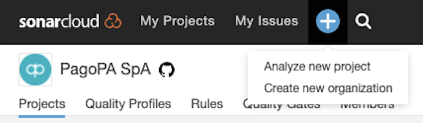
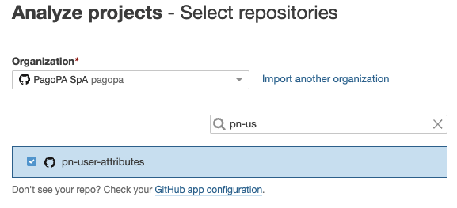

# Continuous Integration Piattaforma Notifiche

## Directory structure
- __bootstrap__: CI pipeline infrastructure resources for CI/CD build and pipeline.
- __infra__: cloud formation stack ci infrastructure.
- __builders__: cloud formation stack template used for continuous integration via CodeBuild.

## CI Pipeline
The CI pipeline stack is deployed by the Cloud Formation template _ci/bootstrap/pn-cicd-pipeline.yaml_.

This is the only one need manual deployment with the following command:

```
source bootstrap.sh cicd eu-central-1
```

- __NOTE__: a _cicd_ profile configuration in `~/.aws/config` and `~/.aws/credential` are needed. 
The CI/CD resources are deployed in Frankfurt because that region support Github connections version 2.

The pipeline read _[infra/root.yaml](infra/root.yaml)_ template to create the CI Stacks. 

It will deploy common resource shared with the CD pipeline like:
- CodeArtifact: Artifact repository for maven, npm, ....
- ArtifactBuckets: Used to store artifact like lambda, static website  
- CodeBuildNotifications: to connect build failure to SNSTopic (ChatBot on Slack)

It uses nested templates in _[builders](builders)_ directory to deploy resources
needed for the CI process like:
- CodeBuild
- ECR (for docker artifacts)

## Add a project to CI pipeline

### 1. Add the project to SonarCloud

SonarCloud is used to collect the static code analysis and code coverage metrics for the project.

Login to [SonarCloud](https://sonarcloud.io) with your github account.

Click on the blue + (plus sign) in the upper toolbar and select "Analyze New Project"  


Select the project in the list and click the blue button "Set Up" on the right panel.


### 2. Configure GitHub Personal Access Token

AWS Code Build deve interagire con il repository GitHub per segnalare il successo o meno della compilazione.

Per abilitare l'interazione con GitHub viene utilizzato per ora un Personal Access Token memorizzato come
secret su _AWS Secrets Manager_

Poichè non ha senso utilizzare token personali associati ad un utente, si è pensato di utilizzare in futuro
degli utenti fittizzi per queste configurazioni (vedi https://pagopa.atlassian.net/browse/PN-1013)

https://docs.aws.amazon.com/codebuild/latest/userguide/access-tokens.html

### 3. Configure the project in the CI pipeline

The process to add a project in the CI pipeline is done by
1. add some lines in _root.yaml_ file.
2. commit and push the root.yaml file into main branch or merge from a feature

Example: Properties depends on the selected _builder_ type.

````yaml
<Name for CI Stack>:
  Type: AWS::CloudFormation::Stack
  Properties:
   TemplateURL: !Sub 'https://s3.amazonaws.com/${PnCiCdTemplatesBucketName}/ci/builders/<builder-type>.yaml'
   Parameters:
   GitHubProjectName: '<pagopa github project name>'
   CodeArtifactDomainName: !Ref 'CodeArtifactDomainName'
   CodeArtifactRepositoryName: !Ref 'CodeArtifactRepositoryName'
   NotificationSNSTopic: !Ref 'NotificationSNSTopic'
  TimeoutInMinutes: <timeout in minutes for build process>
````

## Useful commands

### Create a stack using builders for testing purpose
```
aws cloudformation deploy --stack-name <value> --template-body builders/mvn-jar-codebuild.yaml --profile cicd  \
 --parameters ParameterKey=string,ParameterValue=string,UsePreviousValue=boolean,ResolvedValue=string
```

### Remove stack after test
```
aws cloudformation delete-stack --stack-name <value> --profile cicd --capabilities CAPABILITY_IAM 
```

### Launch a build on CodeBuild
```
aws codebuild start-build --project-name myProject --profile cicd \
 --environment-variables-override "[{\"name\":\"ACTION\",\"value\":\"create\"},{\"name\":\"BRANCH\",\"value\":\"${BITBUCKET_BRANCH}\"}]"
```
