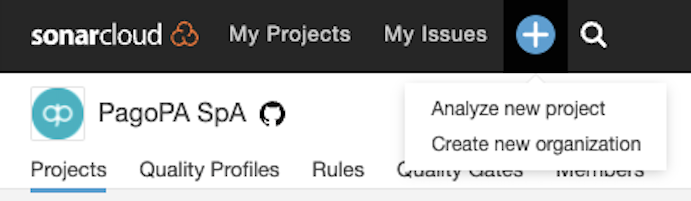
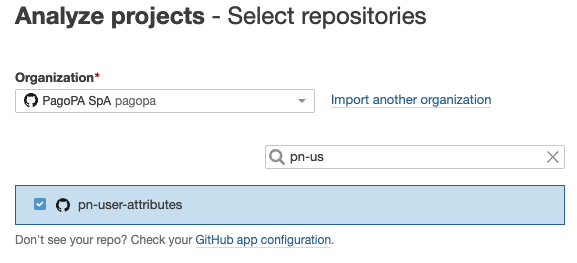

# Continuous Integration Piattaforma Notifiche

## Directory structure
- __bootstrap__: CI pipeline infrastructure resources for CI/CD build and pipeline.
- __infra__: cloud formation stack ci infrastructure.
- __builders__: cloud formation stack template used for continuous integration via CodeBuild.

## CI Pipeline
The CI pipeline stack is deployed by the Cloud Formation template _ci/bootstrap/pn-cicd-pipeline.yaml_.

This is the only one need manual deployment with the following command:

```
source bootstrap.sh cicd eu-central-1
```

- __NOTE__: a _cicd_ profile configuration in `~/.aws/config` and `~/.aws/credential` are needed. 
The CI/CD resources are deployed in Frankfurt because that region support Github connections version 2.

The pipeline read _[infra/root.yaml](infra/root.yaml)_ template to create the CI Stacks. 

It will deploy common resource shared with the CD pipeline like:
- CodeArtifact: Artifact repository for maven, npm, ....
- ArtifactBuckets: Used to store artifact like lambda, static website  
- CodeBuildNotifications: to connect build failure to SNSTopic (ChatBot on Slack)

It uses nested templates in _[builders](builders)_ directory to deploy resources
needed for the CI process like:
- CodeBuild
- ECR (for docker artifacts)

## Add a project to CI pipeline

### 1. Add the project to SonarCloud

SonarCloud is used to collect the static code analysis and code coverage metrics for the project.

Login to [SonarCloud](https://sonarcloud.io) with your github account.

Click on the blue + (plus sign) in the upper toolbar and select "Analyze New Project"  


Select the project in the list and click the blue button "Set Up" on the right panel.


### 2. Configure GitHub Personal Access Token

AWS Code Build deve interagire con il repository GitHub per segnalare il successo o meno della compilazione.

Per abilitare l'interazione con GitHub viene utilizzato per ora un Personal Access Token memorizzato come
secret su _AWS Secrets Manager_

Poichè non ha senso utilizzare token personali associati ad un utente, si è pensato di utilizzare in futuro
degli utenti fittizzi per queste configurazioni (vedi https://pagopa.atlassian.net/browse/PN-1013)

https://docs.aws.amazon.com/codebuild/latest/userguide/access-tokens.html

### 3. Configure the project in the CI pipeline

The process to add a project in the CI pipeline is done by
1. add some lines in _root.yaml_ file.
2. commit and push the root.yaml file into main branch or merge from a feature

Example: Properties depends on the selected _builder_ type.

````yaml
<Name for CI Stack>:
  Type: AWS::CloudFormation::Stack
  Properties:
   TemplateURL: !Sub 'https://s3.amazonaws.com/${PnCiCdTemplatesBucketName}/ci/builders/<builder-type>.yaml'
   Parameters:
   GitHubProjectName: '<pagopa github project name>'
   CodeArtifactDomainName: !Ref 'CodeArtifactDomainName'
   CodeArtifactRepositoryName: !Ref 'CodeArtifactRepositoryName'
   NotificationSNSTopic: !Ref 'NotificationSNSTopic'
  TimeoutInMinutes: <timeout in minutes for build process>
````

## Configuration packages

The `config-package-codebuild.yaml` builder validates YAML syntax and packages a
repository directory, preserving its directory name at the ZIP root. Repository,
directory and ZIP filename are configured by the caller in `infra/root.yaml`.
Manifest references and Data Quality semantics remain the responsibility of the
source repository; this builder does not validate them.

`PnMetrics` packages `pn-metrics/data-quality/config/` as `config-layer.zip`, with
`config/manifest.yaml` and `config/tables/` available at the ZIP root. It publishes
the artifact to the CI bucket under:

```
pn-metrics/commits/<pn_metrics_commitId>/config-layer.zip
```

The CodeBuild webhook builds branch pushes, including branches such as
`SNDM-231`. A build can also be started with a specific source commit. Failed
validation or packaging prevents publication. Build failures use the existing
SNS notification topic. This builder does not emit `BUILD_DONE` or start a CD
pipeline automatically.

### Infra deployment

Add `pn_metrics_commitId` to the environment's `pn-configuration/repository-list.json`.
The existing configuration resolver produces the commit used by CD. For DEV
configurations that use `desired-commit-ids-env.sh` directly, add the same variable
there. The selected commit must have a successful configuration build before CD.

Both Infra update paths pass the value to `deployLogStreaming.sh` through the
optional `-m` argument. The script copies the ZIP into the environment's
`LambdasBucketName` at:

```
<LambdasBasePath>/cdc-preproc-data-quality-config/<pn_metrics_commitId>/config-layer.zip
```

It then sets `PnMetricsCommitId` in the parameters of `pn-logs-export`. A missing
artifact stops the script before this stack is updated. If no commit is supplied,
the copy and parameter injection are skipped, preserving the previous CD flow.

The corresponding `pn-infra` template must declare `PnMetricsCommitId` in the
parent and forward it to the pre-processing fragment. Its Layer uses the existing
`LambdasBucketName` and the key above; the Lambda receives the resulting Layer
version ARN and reads `/opt/config`. Callers with pre-processing disabled must
remain valid without a Metrics version. When the Layer is enabled, its template
must require a non-empty version.

After this initial Infra integration, promoting or rolling back rules requires
changing the Metrics pin and running Infra CD, without changing the Infra pin or
rebuilding the Lambda. CloudFormation still updates the Layer and the Lambda
configuration. Existing commits created before the builder was enabled need an
explicit build before they can be selected for deployment.

## Useful commands

### Create a stack using builders for testing purpose
```
aws cloudformation deploy --stack-name <value> --template-body builders/mvn-jar-codebuild.yaml --profile cicd  \
 --parameters ParameterKey=string,ParameterValue=string,UsePreviousValue=boolean,ResolvedValue=string
```

### Remove stack after test
```
aws cloudformation delete-stack --stack-name <value> --profile cicd --capabilities CAPABILITY_IAM 
```

### Launch a build on CodeBuild
```
aws codebuild start-build --project-name myProject --profile cicd \
 --environment-variables-override "[{\"name\":\"ACTION\",\"value\":\"create\"},{\"name\":\"BRANCH\",\"value\":\"${BITBUCKET_BRANCH}\"}]"
```
